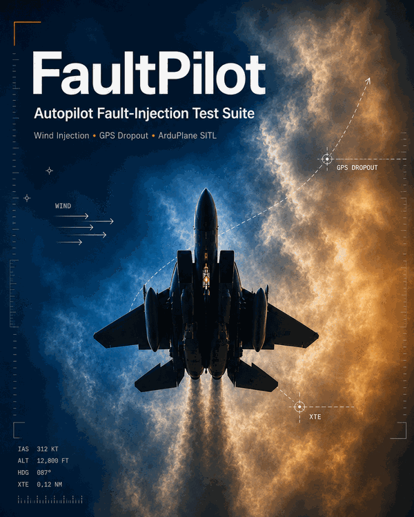

  

<h1 align="center">FaultPilot</h1>

<strong>Fault injection and behavior characterization for autopilots.</strong>

FaultPilot runs unattended fault-injection campaigns against ArduPilot SITL +
Gazebo: it launches the simulation stack, flies the mission, injects a sensor
fault at a precise mission point, verifies the injection by reading it back,
monitors the aircraft's response, classifies the outcome, and packages logs and
metrics with checksums. A flight that cannot prove its own test conditions does
not count — it is recorded and re-flown.

> Status: repository under construction (migration in progress). Do not rely
> on this README until the first tagged release.

## Fault lanes

| Lane | Status |
| --- | --- |
| Wind envelope (`wind_matrix`) | ✅ characterized |
| Airspeed failure (`airspeed_failure`) | ✅ characterized (interim) |
| GPS failure | 🚧 in progress |
| IMU / Compass / Barometer | ⬜ planned |

## License

GPL-3.0 — see [LICENSE](LICENSE).
